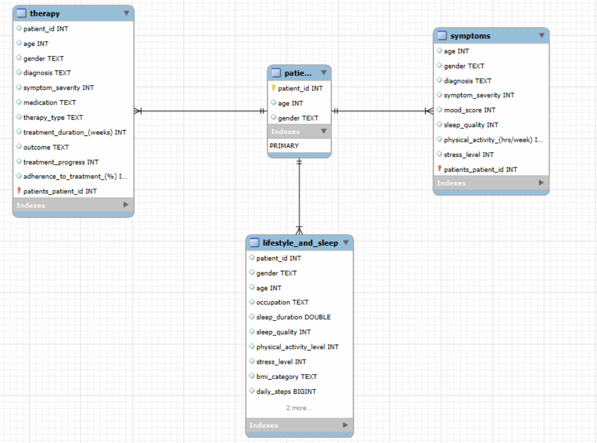

# Wellness at Work
**Insights from our study on Lifestyle, Mental Health Diagnosis, and Effective Treatments**
This explores the intersection of lifestyle factors and mental health. It presents findings and strategies to improve workplace well-being through data-driven insights into sleep, stress, physical activity, and mental health treatments.

- **Objective**: Prevent mental health issues among workers and enhance well-being to reduce absenteeism and improve productivity.
- **Focus Areas**:
  - Relationship between **sleep quality** and stress, BMI, age, and gender.
  - Mental health diagnosis trends across demographics.
  - Effectiveness of various mental health treatments.
- **Key Findings**
    - **Lifestyle and Well-being**
      
       *Sleep and Stress*

        - High stress levels negatively impact sleep quality.
        - The relationship between stress and sleep varies across occupations, highlighting the need for tailored well-being strategies.
          
       *Physical Activity and Sleep*

        - A positive correlation exists between physical activity levels and sleep quality.
          
  - **Mental Health Symptoms and Risks**
    - Young workers (aged 20–35) are more likely to experience mental health issues.
    - Men tend to have poorer sleep quality compared to women, though gender is not always a risk factor for specific diagnoses.
  - **Mental Health Treatments**
    - Therapy methods show moderate success rates (37%–44%), emphasizing the need for more personalized treatments.
    - The average treatment duration is 3–4 months, with medication tailored to specific diagnoses.
 

## Functionality ⚙️

- 🧹 **Data Structure**: Process raw data to remove inconsistencies and prepare it for analysis.
- 🔍 **Data Querying**: Extracting specific information from databases by writing queries to filter, sort, and retrieve relevant data efficiently.
- 📈 **Data Visualization**: Create visual representations of the data to identify trends and patterns.

## Tools Used 🛠️

- **SQL**: Main programming language used for data processing and analysis.
- 🐍 **Python**: Main programming language used for data processing and analysis.
- 🐼 **Pandas**: Library for data manipulation and analysis.
- 📊 **Matplotlib & Seaborn**: Libraries for data visualization.
- 📓 **Jupyter Notebooks**: Interactive environment for data cleaning and visualization.
- 🌐 **Git**: Version control system for tracking changes and collaboration.

## Development Process 🚀

1. 📥 **Data Collection**: Gather comprehensive datasets covering key factors such as sleep, stress levels, physical activity, and medical diagnoses.
2. 🧹 **Data Cleaning**: Remove duplicates, handle missing values (NaNs), standardize column names, and integrate multiple data frames into a unified format. 
3. 🔍 **Data Analysis**: Uncover meaningful correlations, trends, and patterns by applying statistical and exploratory techniques.
4. 📊 **Data Visualization**: Generate insightful graphs, charts, and dashboards to effectively communicate the findings.

## Entity Relation Model 

## Conclusion 📊
Through comprehensive analysis, the project reveals critical insights:

1. **Stress and Sleep:** High stress levels, especially in demanding occupations, have a significant negative impact on sleep quality.
2. **Age and Gender:** Sleep quality is influenced by age and gender, though young employees are generally more at risk for mental health issues.
3. **Therapy Effectiveness:** Current therapy methods show moderate success, underscoring the need for tailored approaches.

## Project Structure 📁

- `clean_data/`:
    - `cleaning.ipynb`: Jupyther Notebook created to clean data.
    - `cleaning_celia.ipynb`: Jupyther Notebook created to clean data.
    - `mental_health_cleaning.ipynb`: Jupyther Notebook created to clean data.
    - `mental_health_symptoms_clean.csv`
    - `mental_health_therapy_clean.csv`
    - `patients.csv`
    - `sleep_lifestyle_clean.csv`
- `data_queries/`: csv created with sql queries to our visualization
    - `data_queries_ana`: data.
    - `data_queries_carlota`: data.
    - `data_queries_celia`: data.

- `original_data/`:
    - `Sleep_health_and_lifestyle_dataset.csv`.
    - `mental_health_diagnosis_treatment_.csv`.
  

  
- `visualizations/`: Folder with all grahps creates to analyse. All of them have been created in `visualization_df.ipynb` Jupyter Notebook.
    - `visualization_ana.ipynb`.
    - `visualization_carlota.ipynb`.
    - `visualization_celia.ipynb`.
- `sql_scripts/`:
    - `miniproject_ironhack_final.sql`.
    - `sql_script_all`: extra sql files.

- `presentation/`: 
  - `PDF_presentation/`: Folder to store PDF presentations.
- `README.md`: File to describe the project and how to set it up.
- `EDR_relation_sleep_and_mental_health.PNG`: Entity relational model.

## Project Presentation 🎤

The project findings are summarized in a detailed presentation, covering:

- 📋 Research goals and methodology.
- 🔍 Key insights and trends.
- 📊 Data visualizations and treatment analysis.

## Project Members 👥

| Name       | GitHub Profile                           |
|------------|------------------------------------------|
| **Celia Manzano** | [GitHub Profile](https://github.com/cemanzanoc) |
| **Carlota Gordillo** | [GitHub Profile](https://github.com/carlotagordillo2) |
| **Ana Pineda** | [GitHub Profile](https://github.com/asdianita) |
| **Laura Sánchez** | [GitHub Profile](https://github.com/laurasanchez20) |
----

Feel free to reach out for any questions or suggestions!
